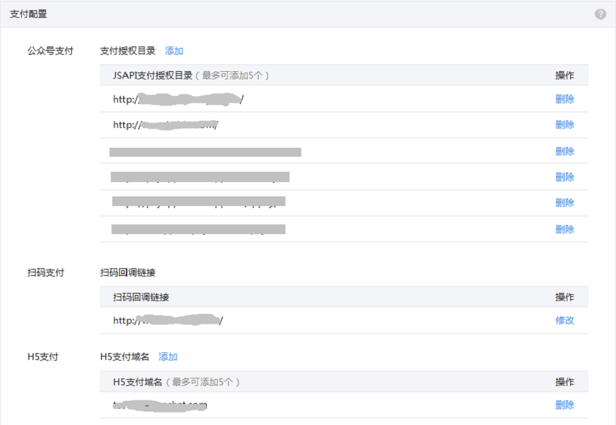
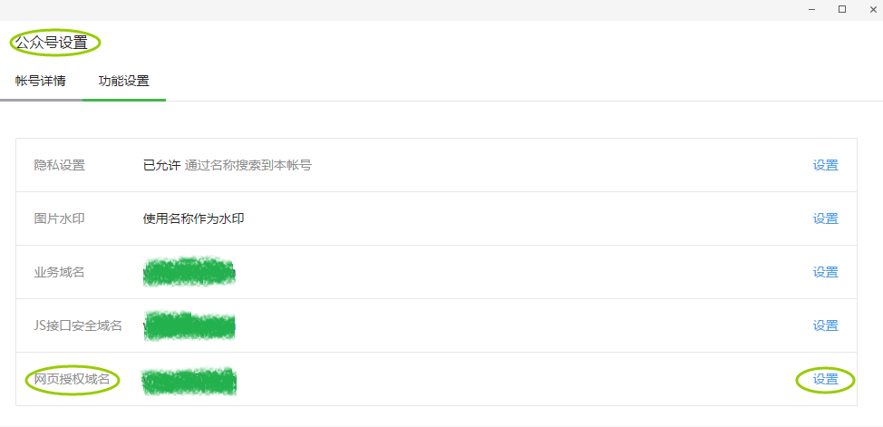
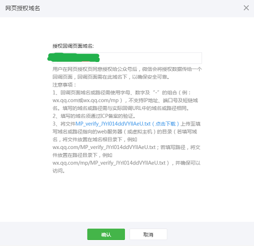

# JSAPI支付  

##  设置支付目录

请确保实际支付时的请求目录与后台配置的目录一致（现在已经支持配置根目录，配置后有一定的生效时间，一般5分钟内生效），否则将无法成功唤起微信支付。

- [微信商户平台][weixin_pay_id]  
  设置您的JSAPI支付支付目录，设置路径：商户平台-->产品中心-->开发配置.  
  JSAPI支付在请求支付的时候会校验请求来源是否有在商户平台做了配置，所以必须确保支付目录已经正确的被配置，否则将验证失败，请求支付不成功。  
  
  
  
  
## 设置授权域名  
==开发==JSAPI支付时，在统一下单接口中要求必传用户openid，而获取openid则需要您在==公众平台==设置获取openid的**域名**，==只有被设置过的域名才是一个有效的获取openid的域名==，否则将获取失败。  

[weixin_pay_id]: pay.weixin.qq.com